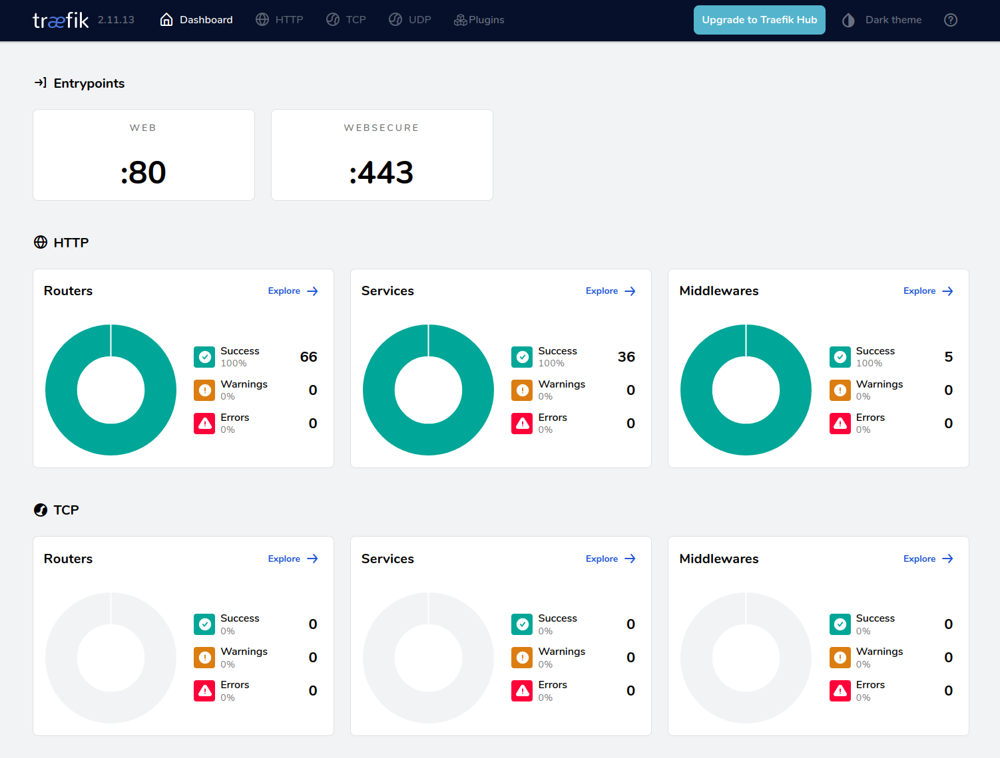

# TP Utilisation de docker 

## Consignes Générales

- Cloner le TP sur votre machine
- Tous vos travaux devront être *giter* et rendu via votre fork (envoi du lien du dépot par mail).
- N'hésitez pas à faire de nombreux commits afin de revenir plus facilement en arrière si nécessaire
- L'énoncé sert également de fichier de compte rendu pour les questions `--> À compléter`

## Partie 0 : Mise en jambe  

- Installer Docker et Docker-Compose sur votre machine local si vous ne l'avez pas déjà 
- Lancer `docker run hello-world` pour vérifier que votre installation fonctionne bien
- Installer l'outil `ctop` (top like pour docker)
- Installer l'outil `lazydocker` (interface TUI pour docker)
- Installer l'outil `docker-slim` (outil d'optimisation d'image docker)

## Partie 1 : Docker et Docker-compose the simple way

- Installer localement l'app `react-hello` et vérifier que tout fonctionne bien
    ```bash
    cd P1/react-hello
    npm install
    npm run dev
     ```
- Créer une image Docker avec une l'APP front Hello world en React (Utilisation de Dockerfile)
   - On prendra soin de ne pas inclure des fichiers et dossiers inutiles dans l'image (fichier .dockerignore)
- Construire l'image en local, crée un conteneur l'utilisant et accèder à l'app

--> docker-compose up --build

- Écrire un fichier `docker-compose.yml` permettant de déployer cette application

- Se connecter au VPS Debian fournie (durant l'installation vous pouvez avancer sur la partie 2)
    - Me transmettre votre clé publique SSH : ag@tetras-libre.fr
    - Se connecter en ssh 
    - Installer Docker et docker-compose
    - Lancer `docker run hello-world` pour vérifier que votre installation fonctionne bien
- Déployer l'app `react-hello` sur le VPS via docker-compose 
  - Note : Il peut être utile de passer par un multi stage build
 
- Vérifier que celle-ci est bien accessible

- Publier votre image sur Dockerhub 

--> À compléter : Fournir URL de l'image sur Dockerhub

- Optimiser la taille de votre image avec docker-slim et la publier sur Dockerhub

--> À compléter : Fournir URL de l'image slim sur Dockerhub et la taille avant/après optimisation

- Modifier votre fichier docker-compose pour que votre app utilise l'image Dockerhub

- Fournissez dans `P1` le ou les fichiers compose finaux et le fichier Dockerfile.

## Partie 2 : Docker et Docker-compose the real way

- L'app de démo `react-hello2` devient un peu plus complexe et utilise maintenant un backend Next.JS et une BDD mariaDB 
   - L'app sera composé de 3 conteneur : frontend, un backend et une BDD mariadb  
   - La BDD contient des données random
   - Le front end affiche ses données en interrogeant le backend 
   - Les secrets doivent être gérés via des variables d'environnements
   - Écrire les fichiers `Dockerfile' et  `docker-compose` permettant de déployer cette application

- Supprimer les containers, est-ce que les données sont toujours là ?
   - Utiliser des volumes si ce n'est pas le cas

- Réduisez au maximum les possibilités de contact entre les conteneurs
   - Le front doit pouvoir communiquer avec le back.
   - Le back doit pouvoir communiquer avec la BDD
   - Pas de contact possible entre front et BDD
   - les `links` ne sont pas authorisés, utilisez seulement des `networks`   

- Déployer cette application sur le VPS
   - Utiliser un VPS Azur avec crédit étudiant ou VPS OVH Tetras si reçu 

- Accèder à la BDD de données depuis votre poste en passant par un tunnel SSH. Je vous conseille l'outil DBeaver. 
    - Seulement le front et l'API doivent être exposé sur le net, attention à la sécurité 

- Fournissez dans `P2` le ou les fichiers compose finaux.    


## Partie 3 : Dockeriser des application existante

- Choisir 2 ou 3 applications existante non conteneurisée disponibles sur Github
  - La complexité de l'application choisie influera la notation
  - Une liste d'application possible est fournie en fin de partie
  - Choisir des applications utilisant des technologies différentes (nodejs, python, ruby, php, go, java, etc.)

--> Fournir l'URL des dépot de l'application


- Écrire l'ensemble des fichiers permettant de déployer ces application avec Docker, docker-compose

- Critères évalués
   - Build reproductible (npm ci, pip install --no-deps, --frozen-lockfile, etc. selon techno).
   - Pas de secrets commités. 
   - Healthcheck présent. 
   - Persistence documentée. 
   - Exposition réseau minimale, Aucune base de données exposée publiquement. 
   - Conteneurs runtime non-root quand praticable.

1. mirador‑integration (dépôt Mirador Integration)

Lien : https://github.com/ProjectMirador/mirador-integration
 
GitHub

Description : Ce dépôt propose des exemples d’intégration de Mirador (une librairie JS d’affichage/annotation d’images IIIF) avec des build systems modernes. 
GitHub
+1

Enjeux techniques principaux à considérer pour la conteneurisation :

Build reproductible : Le projet dépend de Node.js, React, etc. Il faudra s’assurer que le Dockerfile utilise npm ci (ou yarn install --frozen-lockfile) pour garantir que les versions sont bien figées. Ex : ce type de repo « intégration » montre qu’il y a des dépendances de plugins, modules externes.

Pas de secrets commités : Comme il s’agit surtout d’un front/JS, l’enjeu est plus faible côté base de données ou API back­end, mais il faudra vérifier qu’il n’y ait pas de clés d’API, tokens dans le code ou le .env. Le README n’évoque pas de secrets visibles. 
GitHub

Healthcheck présent : Habituellement les front­end seuls ne le font pas, mais c’est un bon plus : on peut ajouter un healthcheck dans le container (ex. wget -q --spider http://localhost || exit 1).

Persistance documentée : Ici, en l’état ce dépôt semble être une application front statique ou semi‐statique (serveur de build). Il n’y a pas de BDD ou de données dynamiques importantes ; donc persistance = faible enjeu ou à documenter « build → static ».

Exposition réseau minimale / aucune base de données exposée : En tant qu’application front, idéalement elle s’expose sur un seul port (ex HTTP 80/443) et n’a pas de back-direct exposé. On devra sécuriser cela dans docker-compose (exposer uniquement front).

Conteneur runtime non-root : Il faudra veiller à ce que le conteneur final (servant l’app) utilise un user non‐root, ce qui est souvent négligé dans les images de démo front.

2. adno (dépôt Adno)

Lien : https://github.com/adnodev/adno
 


Description : Adno est une application web pour la visualisation, édition et partage de narrations sur des images (IIIF), avec une version « full » (éditeur + viewer) ou « light » (viewer seul). 

Enjeux techniques principaux à considérer :

Build reproductible : Comme pour le précédent, dépendances Node.js/JS, mais ici l’architecture pourrait être plus complexe (éditeur + viewer) ce qui implique deux modes de build (build-full, build-light). Il faudra configurer des Dockerfile multi‐stage pour gérer les deux variantes, figer les dépendances (yarn.lock ou package-lock.json), utiliser npm ci ou yarn install --frozen-lockfile.

Pas de secrets commités : Ici likely plus de configuration (édition, peut-être accès à des API, configuration d'édition). On devra vérifier .env.example (présent) et s’assurer que .env n’est pas dans le dépôt avec des valeurs sensibles. 
GitHub

Healthcheck présent : Dans une app plus complète, il est important d’ajouter un healthcheck dans le conteneur (par exemple pour l’éditeur si serveur ou service).

Persistance documentée : Si l’éditeur stocke des données (annotations, parcours), on devra traiter la persistance : volumes Docker, base de données ou stockage de fichiers, ou stockage local du navigateur. Le README indique que « le code ne s’exécute que dans votre navigateur et pas côté serveur » pour la version statique. 

Adno

 Si tu conteneurises, tu devras décider s’il y a une DB, un stockage fichier, ou rien (statique). Documenter ce choix.

Exposition réseau minimale / aucune base de données exposée publiquement : Si tu ajoutes une base de données ou un backend, ce critère devient critique. Sinon, pour une app statique, il s’agit simplement d’exposer le port web et de ne pas ouvrir d’autres services.

Conteneur runtime non‐root : Comme pour le front, veiller à ce que l’image finale pour production tourne avec un utilisateur non-root.

Complexité supplémentaire : L’application supporte deux modes (full / light) ce qui ajoute un enjeu de configuration (quel build utiliser ? quel serveur ?). Le fait qu’elle traite des images IIIF, potentiellement de gros fichiers, peut aussi entraîner des optimisations d’images, cache, etc.


- Faire une PR de votre travail à l'application choisie

Liste application proposée à conteneuriser, vous pouvez en choisir une autre si vous le souhaitez :
Certaines sont vielles, mal documentées, incompréhensibles, c'est volontaire !

- https://github.com/projectmirador/mirador-integration
- https://github.com/Aikon-platform/aiiinotate
- https://github.com/geogebra/geogebra
- https://github.com/LeedRSS/Leed
- https://github.com/gohugoio/hugo
- https://github.com/usebruno/bruno
- https://github.com/bigprof-software/online-rental-property-manager
- https://github.com/adnodev/adno
- https://github.com/leanderseige/antlitz.ninja
- https://github.com/atomotic/iiif-annotation-studio
- https://github.com/chartes/adele-app
- https://github.com/KirinoSan1/IIIF-Application
- https://github.com/slub/iiif-mirador-wrapper-application
- https://github.com/leanderseige/antlitz.ninja
- https://github.com/atomotic/iiif-annotation-studio

- Fournissez dans `P3` le ou les fichiers compose finaux.

## Partie 4 : Utiliser un Application Proxy - Traefik

- Qu'est ce qu'un Reverse Proxy et à quoi est ce que ça sert ? 

Un reverse proxy est un serveur placé devant un ou plusieurs serveurs web. Il reçoit les requêtes des clients et les transmet aux serveurs internes appropriés.
Un application proxy analyse et filtre les requêtes au niveau applicatif pour contrôler l'accès et bloquer les attaques ciblant les applications.

- Installer et déployer Traefik via Docker sur votre VPS
   - Traefik recoit le trafik sur les ports classiques (80, 443)
   - La page dashboard de traefik est déployé à *votreURLdeVPS* et vous permet de vérifier que tout fonctionne

   


- Servir l'App Hello world grace à Traefik et à l'URL : p4.*votreURLdeVPS*.
    - L'app doit fonctionner en HTTPS

- Séparer votre fichier `docker-compose.yml` afin d'avoir un mode DEV utilisable en local sans Traefik et un mode PROD fonctionnant sans Traefik
    - Le passage de l'un à l'autre se fera en changeant la variable COMPOSE_FILE de votre `.env`
    - Dev : mapping de port autorisé,
    - Prod : utilisation de Traefik sans mapping de port (à part pour Traefik lui même)

- Fournissez dans `P4` le ou les fichiers compose finaux.    


## Partie 5 : Évaluation par les pairs

- Mixer les binômes
- Évaluer les travaux des autres binômes sur les critères suivants :
   - Fonctionnalité : Est-ce que l'application fonctionne correctement en local et sur le VPS
   - Qualité des Dockerfile : Est-ce que les images sont optimisées, sécurisées, maintenables
   - Qualité des fichiers docker-compose : Est-ce que les fichiers sont clairs, bien structurés, sécurisés
   - Documentation : Est-ce que les travaux sont bien documentés, clairs et compréhensibles
   - Commentaires supplémentaires : [Ajouter des commentaires ou suggestions pour améliorer le travail évalué]

## Conclusion

La stack proposée `VPS + Docker + Docker-compose + Traefik` est suffisante pour une grande majorité des applications réelles et adaptée à des structures ou projet avec peu de ressources. 
- Peu de complexité à mettre en œuvre 
- Environnement de dev et de prod avec peu de différence 
- Technologie simple et maitrisée par de nombreuses personnes 
- Des possibilités de monitoring presque sans limites avec Traefik
- Peu de dépendances à des services tiers 
    - Un hébergeur VPS
    - DockerHub 

Bien que cette stack soit efficace, elle présente certaines limites. Tout d’abord, la gestion de la montée en charge peut devenir complexe : un simple VPS atteint rapidement ses limites en ressources CPU, RAM et stockage. La haute disponibilité n’est pas native, ce qui signifie que si le VPS tombe, toute l’infrastructure tombe avec lui. De plus, la gestion des mises à jour, des backups et du scaling reste largement manuelle, nécessitant une vigilance opérationnelle importante. Traefik est très puissant, mais peut devenir complexe à maintenir à grande échelle, surtout sans orchestration avancée. Enfin, l’absence d’un orchestrateur comme Kubernetes limite l’automatisation et l’auto-remédiation en cas de panne.

Une alternative adaptée à des environnements plus exigeants serait de migrer vers un cluster Kubernetes (par exemple k3s pour rester léger), combiné avec un fournisseur cloud ou un cluster de machines pour assurer la redondance. Cela permettrait d’obtenir du scaling automatique, de la tolérance aux pannes, une gestion centralisée des secrets, des logs et du monitoring plus mature. Cette approche apporte plus de robustesse et d’automatisation, au prix d’une complexité supérieure à l’installation et à la maintenance.


